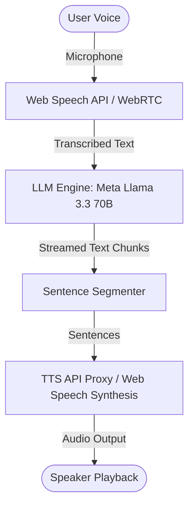

# Voice, STT, and TTS System Documentation

This document serves as a backup and reference for the Voice, Speech-to-Text (STT), and Text-to-Speech (TTS) architecture, components, models, and file structures in the `better-chatbot` project.

---

## 1. System Architecture Overview

The voice interface in this chatbot consists of three core components:
1. **Speech-to-Text (STT) / Dictation**: Dictates user voice input into text.
2. **Text-to-Speech (TTS) / Read Aloud**: Synthesizes assistant responses into audio.
3. **WebRTC Realtime API (OpenAI)**: Bidirectional, low-latency streaming voice model connection (configured but currently inactive in the primary UI).

---

## 2. Component & File Map

The following files implement the voice capabilities in the codebase. All file links use forward-slashed absolute paths:

* **Text-to-Speech (TTS)**:
  * [src/lib/ai/speech/custom-tts.ts](file:///C:/Users/Ronit/.gemini/antigravity/worktrees/better-chatbot/greeting-test-implementation/src/lib/ai/speech/custom-tts.ts) — Client-side custom TTS loader and player.
  * [src/app/api/tts/route.ts](file:///C:/Users/Ronit/.gemini/antigravity/worktrees/better-chatbot/greeting-test-implementation/src/app/api/tts/route.ts) — Backend route that proxies request to the LOVO TTS worker.
* **Speech-to-Text (STT)**:
  * [src/components/dictate-button.tsx](file:///C:/Users/Ronit/.gemini/antigravity/worktrees/better-chatbot/greeting-test-implementation/src/components/dictate-button.tsx) — Real-time dictation button inside the chat prompt input.
* **Voice Chat Hooks & UI**:
  * [src/lib/ai/speech/use-inline-voice.ts](file:///C:/Users/Ronit/.gemini/antigravity/worktrees/better-chatbot/greeting-test-implementation/src/lib/ai/speech/use-inline-voice.ts) — Hook driving hands-free voice sessions within the standard chat layout.
  * [src/lib/ai/speech/custom-voice-chat.ts](file:///C:/Users/Ronit/.gemini/antigravity/worktrees/better-chatbot/greeting-test-implementation/src/lib/ai/speech/custom-voice-chat.ts) — Custom hook driving the fullscreen voice call drawer session.
  * [src/components/chat-bot-voice.tsx](file:///C:/Users/Ronit/.gemini/antigravity/worktrees/better-chatbot/greeting-test-implementation/src/components/chat-bot-voice.tsx) — Top-drawer fullscreen call-like Voice UI.
* **OpenAI Realtime WebRTC (Inactive)**:
  * [src/lib/ai/speech/open-ai/use-voice-chat.openai.ts](file:///C:/Users/Ronit/.gemini/antigravity/worktrees/better-chatbot/greeting-test-implementation/src/lib/ai/speech/open-ai/use-voice-chat.openai.ts) — WebRTC-based OpenAI Realtime client hook.
  * [src/app/api/chat/openai-realtime/route.ts](file:///C:/Users/Ronit/.gemini/antigravity/worktrees/better-chatbot/greeting-test-implementation/src/app/api/chat/openai-realtime/route.ts) — WebRTC session generator backend handler.
* **System Integration Points**:
  * [src/app/api/chat/route.ts](file:///C:/Users/Ronit/.gemini/antigravity/worktrees/better-chatbot/greeting-test-implementation/src/app/api/chat/route.ts) — Main chat completion endpoint handling database persistence overrides.
  * [src/lib/ai/models.ts](file:///C:/Users/Ronit/.gemini/antigravity/worktrees/better-chatbot/greeting-test-implementation/src/lib/ai/models.ts) — Custom model provider routing chat completion requests to Sarvam.
  * [src/components/chat-bot-temporary.tsx](file:///C:/Users/Ronit/.gemini/antigravity/worktrees/better-chatbot/greeting-test-implementation/src/components/chat-bot-temporary.tsx) — Temporary chat interface.
  * [src/components/prompt-input.tsx](file:///C:/Users/Ronit/.gemini/antigravity/worktrees/better-chatbot/greeting-test-implementation/src/components/prompt-input.tsx) — Text input component that controls microphone element visibility.

---

## 3. Model Configuration

| Feature Area | Model | Provider / Endpoint | Notes |
| :--- | :--- | :--- | :--- |
| **Immersive Voice LLM** | `Llama 3.3 70B` | Meta (via `/api/chat`) | Powers the chat completion for the fullscreen drawer |
| **OpenAI Realtime LLM** | `gpt-4o-realtime-preview` | OpenAI WebRTC | Multi-modal audio-to-audio model |
| **TTS Generation** | `tts-1` | LOVO API Worker | OpenAI-compatible endpoint: `https://tts-worker.llamai.workers.dev` |
| **STT Dictation** | Local browser voice engine | Client Web Speech API | Client-side only; zero API cost |
| **WebRTC Transcription** | `whisper-1` | OpenAI Realtime | transcribes audio data chunks to text for WebRTC session overlays |
| **Chat LLM** | `sarvam-2b` | Sarvam AI (`api.sarvam.ai/v1`) | OpenAI-compatible Hindi/English bilingual LLM |

---

## 4. Technical Workflows

### A. Dictation / Input STT
* Uses the browser’s `SpeechRecognition` or `webkitSpeechRecognition` APIs.
* Continuous capture is enabled (`continuous = true`), along with interim partial transcribing (`interimResults = true`).
* For inline voice (`useInlineVoice`), it tracks the timestamp to calculate user speaking duration metadata.

### B. Text-to-Speech (TTS) Proxy & Fallback
* When speech is requested, it issues a `POST` request to `/api/tts` with the text and desired voice identifier.
* The API route intercepts the request, maps legacy names to newer neural voices:
  * `nova`, `shimmer`, `alloy` $\rightarrow$ `en-US-JennyNeural`
  * `echo`, `onyx`, `fable` $\rightarrow$ `en-US-GuyNeural`
* If the API worker returns a failure status (e.g. `502` or `500`), the client hook automatically rolls back to the browser-native `SpeechSynthesisUtterance` player so that audio playback continues uninterrupted.

### C. Voice Call Interruption & VAD
* The immersive Voice Call drawer uses a dynamic **Voice Activity Detection (VAD)** mechanism:
  * Runs a tick loop every `300ms` comparing the last time the user spoke against a dynamic silence threshold.
  * For short sentences (<20 characters), it triggers a response after `1.0s` of silence.
  * For longer sentences, it waits `1.8s` to prevent cutting the user off during mid-thought pauses.
* **Interruption Rule**: If the assistant is currently speaking via the Web Speech/Audio API, and the microphone picks up new significant speech (above a 3-character threshold for finalized speech or 8-character threshold for interim speech), it immediately pauses the active sound element, flushes the queue, and restarts user recording.

### D. Database History Persistence Rules (Voice Chat Sessions)
* When a voice chat is initialized, requests to the backend `/api/chat` completion API include an `X-Voice-Chat: true` request header.
* **Pre-Stream User Message Insertion**: The API route saves the incoming user message to the thread prior to calling `streamText`. This guarantees the user prompt is preserved and protects thread database integrity in the event of an generation timeout or cancellation.
* **Post-Stream Response Bypassing**: When the streaming response ends (`onFinish`), if `isVoiceChat` is true, the route exits immediately and **bypasses saving the assistant response message** to the thread database. This keeps voice response cycles light and avoids cluttering thread history records.

### E. Temporary Chat Mode Disabling
* For privacy protection and state isolation, the temporary chat view ([chat-bot-temporary.tsx](file:///C:/Users/Ronit/.gemini/antigravity/worktrees/better-chatbot/greeting-test-implementation/src/components/chat-bot-temporary.tsx)) explicitly enforces a `voiceDisabled` prop.
* This prop propagates to the prompt input wrapper ([prompt-input.tsx](file:///C:/Users/Ronit/.gemini/antigravity/worktrees/better-chatbot/greeting-test-implementation/src/components/prompt-input.tsx)), which hides the mic dictation buttons and blocks all SpeechRecognition bindings.

